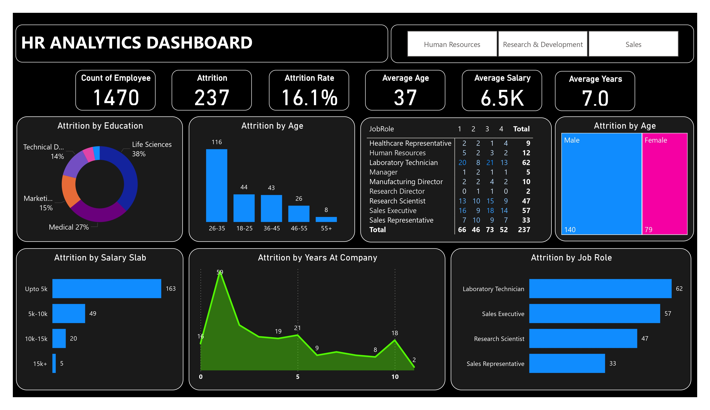
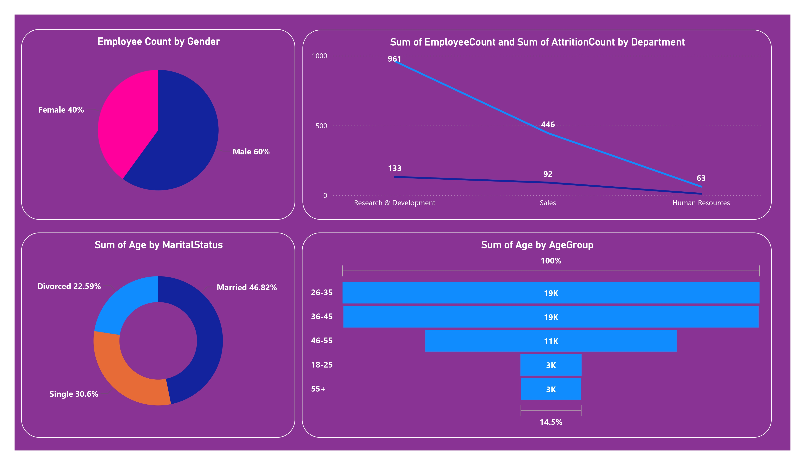

# HR Analytics – Employee Attrition Analysis (Power BI)

## 📌 Project Overview
Employee attrition is a critical challenge for organizations, directly impacting productivity, hiring costs, and employee morale.  
This project focuses on analyzing employee attrition patterns using **Power BI** to help HR teams identify risk factors, improve retention strategies, and make data-driven workforce decisions.

The dashboard provides both **high-level KPIs** and **deep-dive insights** into employee behavior across departments, roles, compensation, tenure, and demographics.

---

## 🎯 Objectives
- Understand the key drivers of employee attrition
- Identify high-risk employee segments
- Support HR teams in improving hiring and retention strategies
- Enhance employee experience through data-backed insights

---

## 📊 Dashboard Highlights

### Page 1 – HR Attrition Overview
- Total Employees, Attrition Count & Attrition Rate
- Attrition by:
  - Age Group
  - Education Field
  - Salary Slab
  - Gender
  - Job Role
  - Years at Company
- Department-level filtering (HR, R&D, Sales)

This page answers **“What is happening?”**

---

### Page 2 – Attrition Drivers & Risk Analysis
- Early attrition patterns (first 1–2 years)
- Role-wise attrition concentration
- Compensation pressure analysis
- Job stability indicators
- Workforce risk segmentation

This page answers **“Why is it happening and where should HR intervene?”**

---

## 🧠 Key Learnings & Business Impact

### 1️⃣ Identified Key Factors to Reduce Attrition
- Early-tenure employees show the highest attrition
- Certain job roles contribute disproportionately to overall attrition
- Lower salary slabs are strongly correlated with higher employee turnover

---

### 2️⃣ Improved the Hiring Process
- Insights help HR refine candidate profiling
- Identification of roles requiring better onboarding and expectation setting
- Supports data-driven workforce planning

---

### 3️⃣ Improved Employee Experience
- Attrition analysis highlights gaps in compensation, role stability, and career growth
- Enables HR teams to design targeted retention and engagement strategies

---

### 4️⃣ Made the Workforce More Productive
- Reduced attrition leads to lower rehiring costs and better team continuity
- Focus on stabilizing high-impact roles improves operational efficiency

---

### 5️⃣ Gained Employee Trust
- Transparent, data-backed HR decisions promote fairness
- Helps build confidence in HR policies and leadership actions

---

## 🛠️ Tools & Technologies
- **Power BI** – Data modeling, DAX, interactive dashboards
- **DAX** – Custom measures for attrition rate, averages, and risk indicators
- **CSV Dataset** – HR employee data

---

## 📂 Dataset
The dataset includes:
- Employee demographics
- Job role & department details
- Compensation data
- Tenure information
- Attrition status

*(Dataset used for learning and analytical purposes.)*

---

## 📈 Outcome
This project demonstrates how HR analytics can move beyond reporting to deliver **actionable insights** that improve retention, productivity, and employee trust.

---

## 👤 Author
**Rahul Goraksha**  
Aspiring Data Analyst | Power BI 

---

## 📬 Feedback & Suggestions
Feel free to raise issues or suggest improvements.  
This project is continuously evolving as part of my data analytics learning journey.
